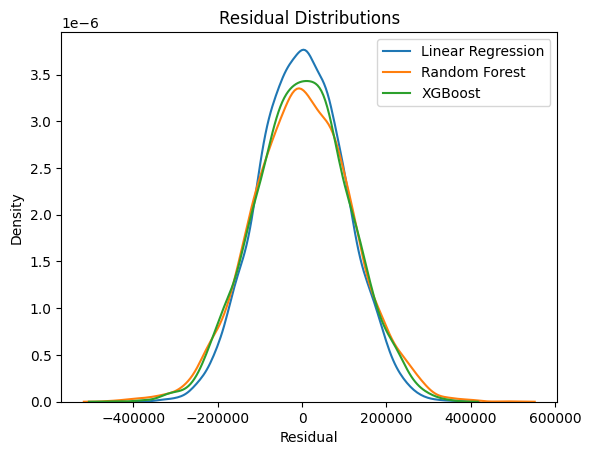

# USHousing_DecisionTrees
This is a study I did on a dataset provided by Escola DNC (https://www.escoladnc.com.br/)

This dataset lists 5000 entries of houses with their addresses and some related quantitative variables:

Those variables are: ```Avg_Area_Income```,	```Avg_Area_House_Age```,	```Avg_Area_Number_of_Rooms```,	```Avg_Area_Number_of_Bedrooms```,	```Area_Population``` and	```Price```.

.png)

Here are their correlations:

.png)

Here are the $R²$ results from each model tested:
- Linear Regression: $91.7%$
- Random Forest: $88.7%$
- XGBoost: $89.9%$

The histplot curves:


The residuals:


It's safe to assume the model is very linear and simple enough to the point XGBoost and Random Forest can't overperform the simpler Linear Regression model.
